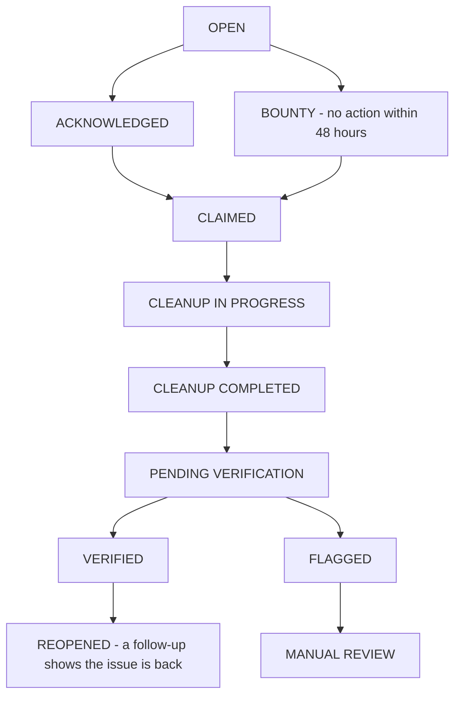
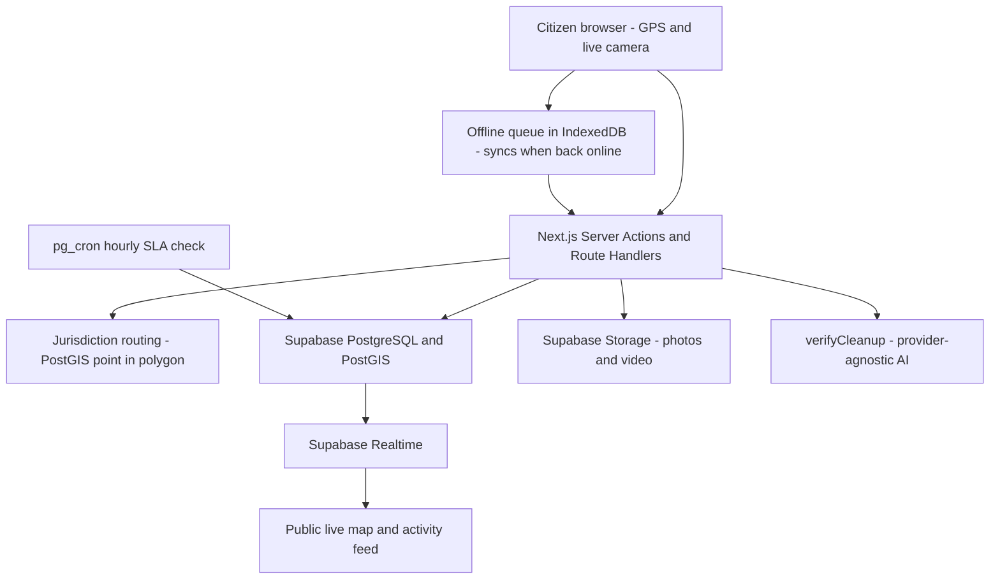

# Mysuru Janseva — Report it. Track it. Act on it. Verify it.

> HackMysuru 1.0 · Phase 1 · Civic Governance & Clean Mysuru
> Team `Bug Busters` (`HM26-1E71`)

| 📎 Submission links | 📋 Templates | 🏗️ Architecture | 🛡️ Hard constraints | ⚙️ Setup | 🤖 AI usage | ⚠️ Limitations |
|---|---|---|---|---|---|---|
| [resource.md](./resource.md) | [resource-templates/](./resource-templates/) | [docs/architecture.md](./docs/architecture.md) | [docs/constraints.md](./docs/constraints.md) | [docs/setup.md](./docs/setup.md) | [ai.md](./ai.md) | [docs/limitations.md](./docs/limitations.md) |

---

## 1. Problem Understanding & Sub-problem

**Chosen sub-problem:** Jurisdiction routing + end-to-end accountability (a public audit trail from report to verified resolution)

- **The gap we saw:** Civic responsibility in Mysuru is split across the Mysuru City Corporation (MCC), Town Panchayats and Gram Panchayats. Residents report through informal channels, complaints get bounced between offices or ignored, and nothing shows who owns an issue or what happened to it afterwards.
- **Why it matters:** Delayed cleanups, duplicate complaints, no way to measure resolution, and a steady loss of citizen trust. A garbage pile that is "closed" on paper but still on the street helps nobody.
- **Why we chose this over the others:** Routing and accountability are the root cause — better forms or dashboards don't help if a report never reaches the right owner, or vanishes after submission. Fixing ownership and follow-through unifies the whole citizen-to-civic-staff journey.
- **What "solved" looks like for us:** A citizen never has to decide which office owns a problem. Every report gets a public ID, a jurisdiction assigned from its GPS location, and a timestamped timeline, so it cannot silently disappear — and if no one acts within 48 hours, it becomes a public cleanup bounty.

## 2. Target Users & Mysuru Context

| User | Their situation | What they need from us |
|---|---|---|
| **Resident / citizen** (including those near the MCC–panchayat edge) | Doesn't know which office owns the spot; reports informally; never hears back; may have patchy mobile data | Report once from their phone, see who owns it, follow its status, and check whether the cleanup actually happened |
| **MCC / Panchayat official** | Receives complaints that may not be theirs; no shared record of what was done or when | A queue of issues already routed to their jurisdiction, with SLA countdowns and a simple claim → clean → upload-proof workflow |
| **NGO / community organisation** | Willing to help, but can't see which issues are being ignored | A public list of overdue issues (bounties) to claim, with points and visible impact |
| **Public visitor** | Wants to know whether the city is really improving | A no-login live map, report timelines and transparency statistics by ward |

**Local context we designed for:**

- **Overlapping jurisdictions** — 65+ MCC wards plus adjacent Town/Gram Panchayats, so ownership is decided automatically from the report's coordinates (PostGIS point-in-polygon), not by the citizen.
- **Unreliable connectivity** — reports are captured on the device and queued locally (IndexedDB), then synced automatically when the network returns.
- **Everyday phones** — mobile-first web app (no native app to install) with a gallery-upload fallback when camera access fails.
- **Trust and privacy** — location is captured only at the moment of reporting (no continuous tracking), and public pages show an anonymous identifier instead of personal contact details.
- **Language** — the interface is English-first; Kannada/multilingual support is on the [roadmap](#8-known-limitations--roadmap).

## 3. Solution Overview & Core Journey

Mysuru Janseva is a real-time civic accountability platform. Citizens report an issue with their current GPS location plus live-camera photos and a short video; the system routes it to the responsible jurisdiction, shows it on a public live map, and tracks it until the cleanup is done and verified — with public follow-up if the problem returns. Every report is a permanent public record with a full timeline.

**Core journey:**

1. **Citizen reports** — opens the report screen; the app captures the current GPS position (with accuracy), then the live camera captures 3 photos and a short video. Input is validated (location plausibility, duplicates, abusive text).
2. **System routes and publishes** — the report gets a public ID (e.g. `MC-10482`), is assigned to a jurisdiction by point-in-polygon lookup, and appears instantly on the public live map. A 48-hour SLA clock starts.
3. **Government or community acts** — an official claims the report, cleans up, and uploads "after" evidence. If nobody acts within 48 hours, it becomes a 🟠 **public cleanup bounty** that eligible NGOs/community members can claim for points.
4. **Public follows up and verifies** — anyone can submit a follow-up ("was this really resolved?"). Optional AI compares before/after evidence, but uncertain or suspicious cases go to human review. Confirmed problems **reopen** the report, and the transparency dashboard and leaderboards update live.

**Report lifecycle:**



**Screenshots:** `<2–4 images under docs/images/, each < 1 MB>`

## 4. Architecture

Offline-first Next.js web app → Next.js Server Actions/Route Handlers → Supabase (PostgreSQL + PostGIS, Auth, Realtime, Storage), with a PostGIS jurisdiction-routing step, an hourly SLA job, and a provider-agnostic AI verification interface.



➡️ Components, data model and APIs: **[docs/architecture.md](./docs/architecture.md)**

## 5. Tech Stack & AI Usage

**Stack:** Next.js · TypeScript · Tailwind CSS · shadcn/ui · Leaflet / react-leaflet · Supabase (PostgreSQL + PostGIS, Auth, Realtime, Storage) · pg_cron scheduler · Vercel (full rationale in [docs/architecture.md](./docs/architecture.md#tech-stack))

**AI tools used in development:** `<e.g. Codex, Hermes, Google Antigravity — confirm the final list>`

**AI inside the product:** Optional cleanup verification behind a replaceable `verifyCleanup(before, after)` interface that returns `verified | rejected | uncertain` with a confidence and reason. AI is a helper, never the sole authority — uncertain results go to manual review, and the app works fully if the AI provider is unavailable. Provider/model: `<fill in once selected>`

➡️ Full disclosure: **[ai.md](./ai.md)**

## 6. Decision Log (Summary)

- **Chose:** Supabase as a managed backend (Postgres/PostGIS + Auth + Realtime + Storage), **over:** a custom API + separate PostgreSQL + object storage
- **Because:** It removes most infrastructure work inside a 72-hour build and gives us realtime and spatial queries out of the box, at the cost of greater dependence on a managed service
- **First thing to break at city scale:** Too many live map markers and realtime updates — we would add marker clustering, viewport-bounded queries, spatial indexes and cached aggregate statistics

➡️ Full decision log: **[resource.md](./resource.md#4-submission-artifacts-google-drive)** · Template: **[decision-log-template.md](./resource-templates/decision-log-template.md)**

## 7. Setup & Run

```bash
git clone <repo-url> && cd <repo>
npm install && npm run dev
```

You will need a Supabase project and a `.env.local` file with its keys — details below.

➡️ Prerequisites, environment variables, seed data and offline testing: **[docs/setup.md](./docs/setup.md)**

## 8. Known Limitations & Roadmap

**Known limitations**

- **GPS can be spoofed.** We describe evidence as "location captured from the reporting device", not as tamper-proof.
- **AI can be wrong.** It only flags and assists; uncertain or suspicious results go to human review.
- **Jurisdiction boundaries are simplified.** The MVP uses simplified/synthetic boundaries rather than official MCC and panchayat data.
- **Media needs moderation, and offline sync has edge cases** (e.g. conflicts, large video uploads on weak networks).
- **No production civic integration.** Government sign-in and department-system integration are not implemented.

**Roadmap**

| Stage | Planned work |
|---|---|
| **Next** | Load official ward/panchayat boundary data · stronger duplicate detection · improved moderation |
| **Scale** | Marker clustering · spatial indexes · pagination · cached statistics · media compression · rate limiting · queue-based AI verification |
| **Later** | Kannada/multilingual interface · push notifications · advanced heatmaps and badges · real government authentication and department integration |

➡️ Full list, edge cases and scaling roadmap: **[docs/limitations.md](./docs/limitations.md)**

---

## Team

| Name | Role | GitHub |
|---|---|---|
| Syed Naheed Ahmed | Developer | [@n4heed](https://github.com/n4heed) |
| Varun P | Developer | [@varunrao246](https://github.com/varunrao246) |
| Vivek Urs G A | Developer | [@vats1126](https://github.com/vats1126) |
| Vignesh Kumar M | Developer | [@VigneshKumar2709](https://github.com/VigneshKumar2709) |

## License

`<MIT / Apache-2.0 / None>`. You retain full ownership of your code.
