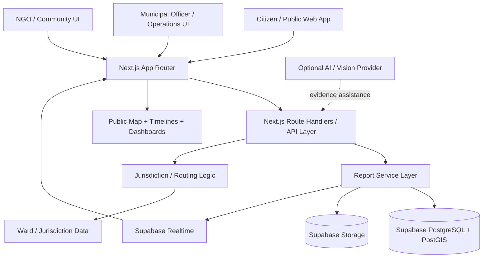
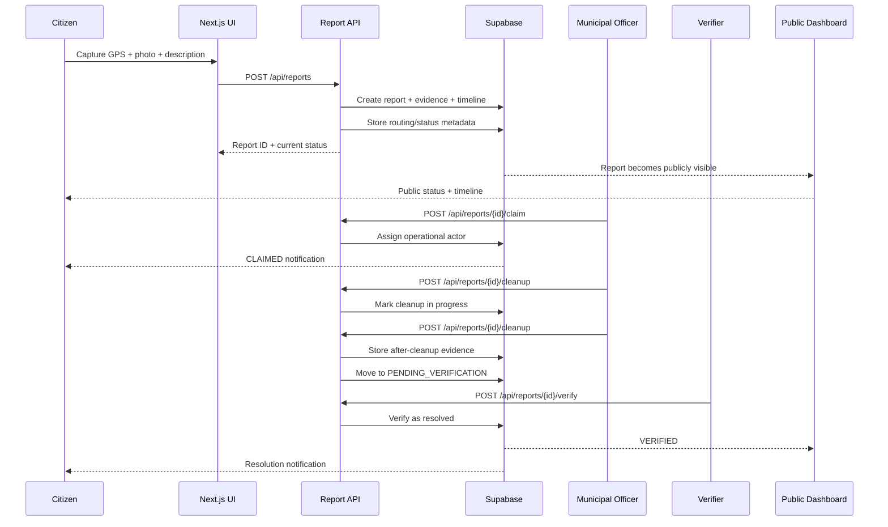
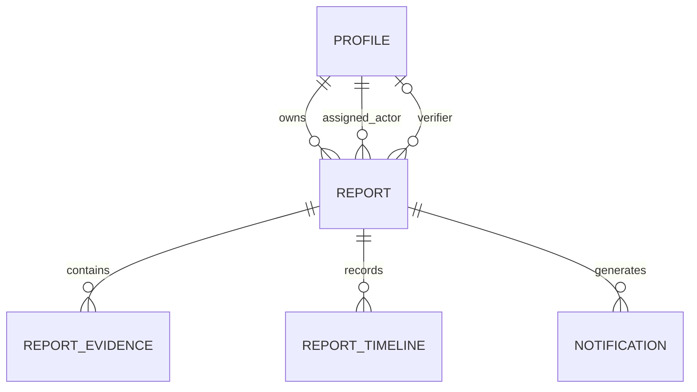
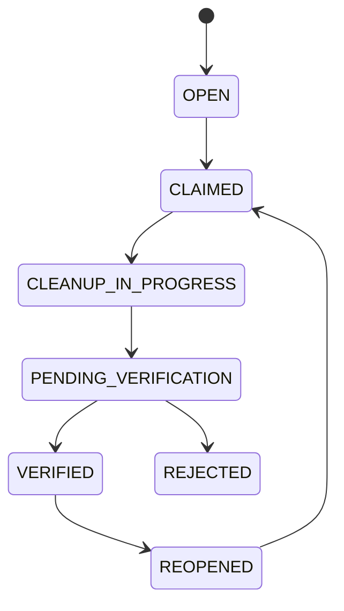
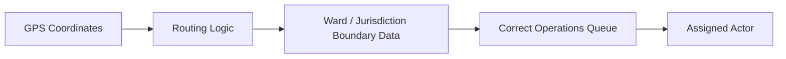
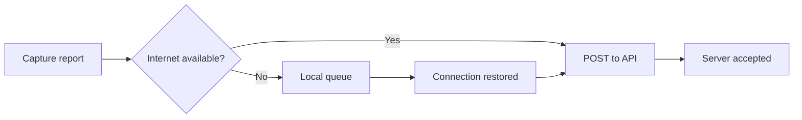
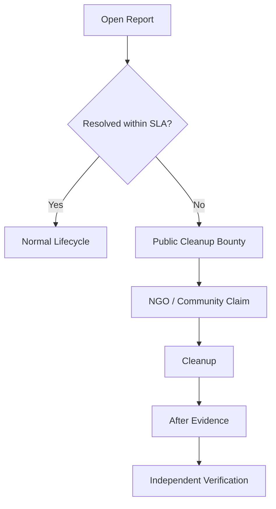
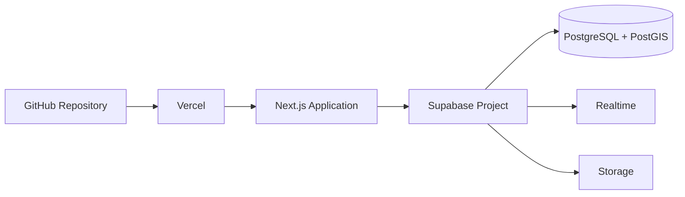
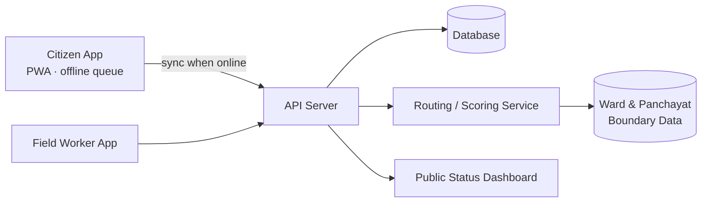
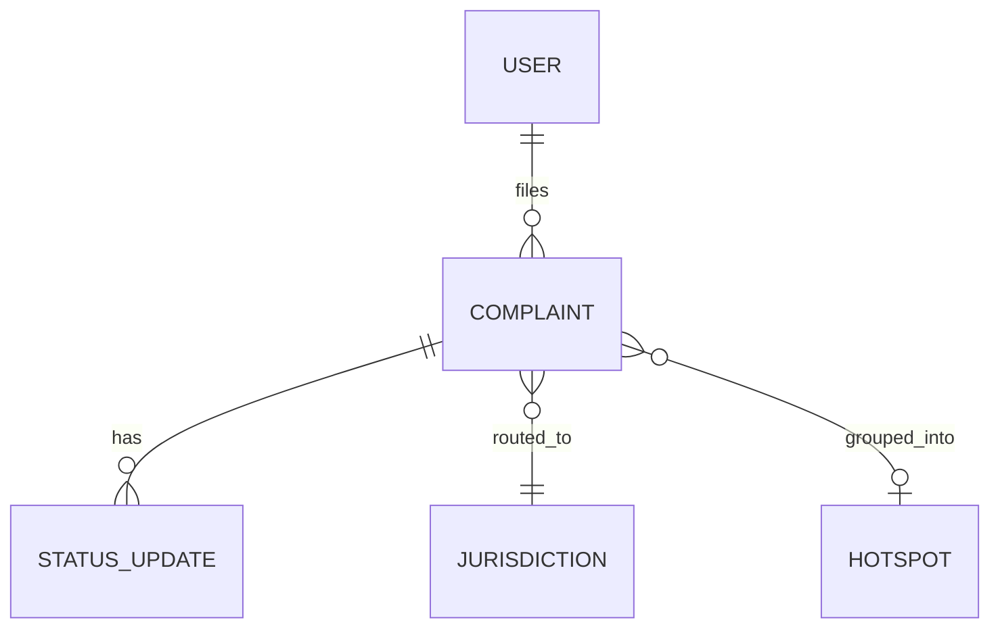

# Architecture

[← Back to README](../README.md)

## System Diagram
# Mysuru Janseva — Architecture Notes

[← Back to README](../README.md) · [Architecture Template](./architecture.md)

## 1. Architecture Overview

Mysuru Janseva is designed as a **real-time civic accountability and coordination layer**.

The system connects four main actors:

- **Citizen** — reports civic issues, provides GPS/evidence, follows progress, and can submit follow-ups or reopen a report.
- **Public Visitor** — views public reports, map data, status, evidence, timelines, transparency information, and city/ward activity.
- **Municipal Officer** — claims routed reports, starts and completes cleanup, uploads after-cleanup evidence, and moves reports to verification.
- **NGO / Community** — can claim eligible public cleanup bounties and perform community-led cleanup.

The architecture separates **public visibility** from **operational permissions**:

> Civic information is public by default; role determines which actions a user can perform.

---

## 2. High-Level Architecture



### Architectural principle

The **core civic workflow does not depend on AI**.

AI can assist with tasks such as evidence review or future image verification, but reporting, routing, claiming, cleanup, verification, status history, and public transparency remain deterministic application workflows.

---

## 3. End-to-End Request Flow

Example: a citizen reports an overflowing waste collection point.



---

## 4. Application Layers

### Presentation Layer

**Technology:** Next.js, React, TypeScript, Tailwind CSS, shadcn/ui, Lucide, Leaflet/react-leaflet.

Responsibilities:

- Role selection and session state
- Public map
- Report wizard
- Report detail page
- Operations dashboard
- Evidence capture/upload
- Follow-up and reopen interactions
- Notifications
- Responsive mobile/desktop experience

Main routes currently include:

```text
/welcome
/
/report
/report/[id]
/leaderboard
/transparency
/dashboard
/profile
```

---

### API Layer

**Technology:** Next.js Route Handlers.

Responsibilities:

- Validate incoming requests
- Apply role/action authorization
- Create and update reports
- Manage claim/cleanup/verification transitions
- Return stable API responses
- Protect lifecycle rules from direct UI manipulation

Current core APIs:

| Method | Endpoint | Purpose |
|---|---|---|
| `GET` | `/api/health` | Backend/configuration health |
| `GET` | `/api/reports` | Fetch public reports |
| `POST` | `/api/reports` | Create a report |
| `GET` | `/api/reports/[id]` | Fetch a report and lifecycle data |
| `POST` | `/api/reports/[id]/claim` | Claim by an eligible operations actor |
| `POST` | `/api/reports/[id]/cleanup` | Start/complete cleanup |
| `POST` | `/api/reports/[id]/verify` | Verify or reject cleanup |

---

### Service Layer

The report service layer is the boundary between UI/API logic and Supabase.

Responsibilities:

- Map database records to frontend report models
- Centralize lifecycle operations
- Validate actor relationships
- Enforce anti-collusion rules
- Keep the frontend independent of raw database structure
- Provide graceful fallback behavior when the backend is unavailable

This layer is important because the frontend should not contain business-critical workflow rules by itself.

---

### Data Layer

**Technology:** Supabase PostgreSQL with PostGIS.

Core entities include:

- Profiles
- Reports
- Report Evidence
- Report Timeline
- Notifications

Important conceptual relationships:



### Ownership model

Three actor relationships are intentionally different:

```text
REPORT OWNER
    = citizen who originally submitted the report

ASSIGNED ACTOR
    = municipal officer or NGO/community actor performing the work

VERIFIER
    = independent actor responsible for verification
```

Claiming a report **never transfers ownership** away from the original citizen.

This prevents operational responsibility from being confused with civic ownership.

---

## 5. Core Report Lifecycle

The report lifecycle is modeled as an operational state machine rather than a collection of unrelated UI flags.



A separate bounty path is triggered for unresolved eligible reports:

```text
OPEN
  ↓
SLA threshold reached
  ↓
PUBLIC CLEANUP BOUNTY
  ↓
NGO / Community claim
  ↓
Cleanup
  ↓
After evidence
  ↓
Pending verification
  ↓
Verified / Rejected
```

---

## 6. Location and Jurisdiction Architecture

Each report captures a point-in-time location rather than continuously tracking the citizen.

Stored location information includes:

```text
latitude
longitude
GPS accuracy
captured_at
```

The location is used for:

1. Geographically anchoring the report
2. Map visualization
3. Jurisdiction routing
4. Ward-level analytics
5. Duplicate detection
6. Public accountability

The intended routing pipeline is:



Routing should be deterministic and explainable where possible.

---

## 7. Evidence Architecture

A report is not just a text complaint.

The evidence model supports:

```text
Report
 ├── GPS location
 ├── Description
 ├── Category
 ├── Photo(s)
 ├── Video metadata
 ├── Timestamp
 └── Lifecycle timeline
```

Cleanup completion can include **after-cleanup evidence**, creating a before/after accountability chain.

This makes the public record more useful than a simple “complaint submitted” system.

---

## 8. Offline-First Reporting

The reporting flow is designed around unreliable mobile connectivity.



The client can preserve the reporting intent locally and synchronize when connectivity returns.

The backend remains the source of truth after synchronization.

---

## 9. Realtime and Public Transparency

Supabase Realtime is used to keep operational and public views aligned.

A typical change propagates as:

```text
Officer changes status
        ↓
Database update
        ↓
Realtime event
        ↓
Public report / dashboard refresh
        ↓
Timeline changes
        ↓
Citizen notification state
```

This avoids requiring citizens to repeatedly reload a report to understand what happened.

---

## 10. Notification Architecture

Lifecycle events map to notification events such as:

```text
REPORT_SUBMITTED
REPORT_ROUTED
REPORT_CLAIMED
CLEANUP_STARTED
CLEANUP_COMPLETED
PENDING_VERIFICATION
VERIFIED
REJECTED
UNCERTAIN
REOPENED
FOLLOW_UP_RECEIVED
BOUNTY_CREATED
```

Example:

```text
REPORT_CLAIMED
    ↓
Timeline entry
    +
Public status update
    +
Citizen notification
```

The timeline is the durable public history; notifications are the user-facing delivery mechanism.

---

## 11. SLA and Bounty Logic

The platform treats unresolved reports as an accountability problem, not just a queue item.



The bounty path creates a second operational channel without hiding the original government accountability trail.

---

## 12. Security and Authorization

The system separates **what a user can see** from **what a user can do**.

Examples:

| Actor | Can view public reports | Can claim | Can cleanup | Can verify |
|---|---:|---:|---:|---:|
| Citizen | Yes | No | No | No |
| Public Visitor | Yes | No | No | No |
| Municipal Officer | Yes | Yes | Yes | No for own assignment |
| NGO / Community | Yes | Eligible bounty only | Yes | No for own assignment |
| Independent Verifier | Yes | No | No | Yes |

Important integrity rule:

> The actor who performs cleanup must not be the same actor who independently verifies that cleanup.

This is enforced at the service/API layer, not only by hiding buttons in the UI.

---

## 13. Resilience and Graceful Degradation

The frontend is designed to remain usable when backend connectivity is temporarily unavailable.

The current implementation keeps a local fallback/demo dataset so the public interface and core walkthrough remain functional during temporary backend failures.

The architecture therefore has two operational paths:

```text
Primary:
UI → API → Supabase

Fallback:
UI → Local persisted demo state
```

The fallback is a resilience/demo mechanism, not a replacement for the central database.

---

## 14. AI Boundary

AI is intentionally kept behind an optional provider-independent interface.

Possible future AI responsibilities:

- Evidence classification
- Image-based issue verification
- Duplicate similarity assistance
- Description/category assistance
- Uncertainty flagging

AI does **not** own the authoritative civic lifecycle.

For example:

```text
AI says:
"Evidence probably shows a waste issue."

Application still decides:
OPEN → CLAIMED → CLEANUP → VERIFICATION → VERIFIED
```

This keeps the system auditable and prevents an opaque model from becoming the source of truth for civic status.

---

## 15. Deployment Architecture



Deployment responsibilities:

| Layer | Technology |
|---|---|
| Source control | GitHub |
| Application hosting | Vercel |
| Web framework | Next.js |
| Database | Supabase PostgreSQL |
| Geospatial support | PostGIS |
| File storage | Supabase Storage |
| Realtime updates | Supabase Realtime |
| Frontend | React + TypeScript |
| Styling | Tailwind CSS |
| Maps | Leaflet / React Leaflet |

---

## 16. Key Architecture Decisions

### Why Next.js?

One application can provide the public UI, operations UI, and API layer without introducing a separate frontend/backend repository for the MVP.

### Why Supabase?

It provides PostgreSQL, PostGIS, Storage, Realtime, and row-level security primitives in one backend platform.

### Why PostGIS?

Civic issues are inherently geographic. Spatial data supports map rendering, jurisdiction boundaries, nearby-issue analysis, and future radius-based duplicate detection.

### Why a service layer?

It prevents critical lifecycle logic from being duplicated across pages and API handlers.

### Why keep AI optional?

The civic workflow must remain deterministic, explainable, and operable even when an AI provider is unavailable.

### Why separate owner, assignee, and verifier?

This preserves accountability and prevents an operations actor from becoming the owner or sole judge of their own work.

---

## 17. Scalability Path

The current design can scale without changing the core civic model.

Potential next steps:

```text
MVP
 ↓
More wards / higher report volume
 ↓
Spatial indexes + optimized queries
 ↓
Background jobs for notifications/SLA checks
 ↓
Object storage + CDN for evidence
 ↓
Dedicated routing service
 ↓
Analytics / heatmaps / recurring-issue detection
 ↓
Multiple municipalities
```

The report lifecycle, evidence chain, and actor separation can remain stable as infrastructure components evolve.

---

## 18. Architecture Summary

Mysuru Janseva is intentionally built around a simple principle:

```text
Capture reality
    ↓
Anchor it geographically
    ↓
Route responsibility
    ↓
Make action visible
    ↓
Collect proof of action
    ↓
Independently verify
    ↓
Keep the history public
```

The architecture therefore combines:

**Next.js + TypeScript + Supabase + PostGIS + Storage + Realtime + Leaflet**

with deterministic civic workflow rules and an optional AI layer.

<!-- Required: a diagram, not just text. Mermaid renders natively on GitHub.
An exported PNG under docs/images/ is also fine. -->



## Request Walkthrough

<!-- Trace ONE real request end-to-end, e.g. "citizen files a complaint". -->

1. `<Client captures photo + GPS, stores in local queue>`
2. `<On reconnect, POST /api/complaints>`
3. `<Server checks duplicates within 50 m / 7 days>`
4. `<Routing service resolves jurisdiction + confidence>`
5. `<Complaint lands in the right queue; citizen sees status>`

## Components

| Component | Responsibility | Tech | Code location |
|---|---|---|---|
| `<Client>` | `<...>` | `<...>` | `src/<...>` |
| `<API>` | `<...>` | `<...>` | `src/<...>` |
| `<Data store>` | `<...>` | `<...>` | `src/<...>` |
| `<ML / rules engine>` | `<...>` | `<...>` | `src/<...>` |

## Data Model



| Entity | Key fields | Notes |
|---|---|---|
| `<Complaint>` | `<id, type, lat, lng, photo_url, trust_score, status>` | `<...>` |
| `<...>` | `<...>` | `<...>` |

## Key APIs

| **Method** | **Endpoint** | **Purpose** | **Auth** |
|---|---|---|---|
| `GET` | `/api/health` | Check backend configuration and Supabase connectivity | Public |
| `GET` | `/api/reports` | Fetch public civic reports for the map, dashboard feeds, and reporting views | Public |
| `POST` | `/api/reports` | Create a new civic report with location, category, description, and evidence metadata | Citizen / Public |
| `GET` | `/api/reports/[id]` | Fetch one report with status, evidence, timeline, assignment, and verification data | Public |
| `POST` | `/api/reports/[id]/claim` | Claim an eligible report as a municipal officer or eligible NGO/community actor | Operations role |
| `POST` | `/api/reports/[id]/cleanup` | Start cleanup or submit cleanup completion with after-cleanup evidence | Operations role |
| `POST` | `/api/reports/[id]/verify` | Verify or reject cleanup; independent verification is required | Verifier |
| `POST` | `/api/reports/[id]/follow-up` | Add a public follow-up to an existing report | Citizen / Public |
| `POST` | `/api/reports/[id]/reopen` | Reopen a previously resolved report when the issue persists or returns | Citizen / Public |

## Tech Stack

| **Layer** | **Choice** | **Why this over alternatives** |
|---|---|---|
| Frontend | **Next.js + React + TypeScript + Tailwind CSS + shadcn/ui + Leaflet/react-leaflet** | One responsive application can support citizen, public, and operations workflows while keeping the UI strongly typed and the map experience interactive. |
| Backend | **Next.js Route Handlers + service layer** | Keeps the MVP backend close to the application, reduces deployment complexity, and centralizes civic workflow rules in a reusable service layer. |
| Database | **Supabase PostgreSQL + PostGIS** | Provides relational data, geospatial capabilities, Row Level Security, and managed backend infrastructure in one platform. |
| Storage / Realtime | **Supabase Storage + Supabase Realtime** | Stores evidence assets separately from relational records and enables status/timeline changes to propagate to connected interfaces. |
| ML / AI | **Optional provider-independent AI / vision interface** (details in [ai.md](../ai.md#3-ai-inside-the-product-runtime)) | AI is deliberately not the source of truth for the civic lifecycle; the core reporting, routing, cleanup, verification, and transparency workflow works without an AI provider. |
| Hosting | **Vercel** | Native fit for Next.js with GitHub-based deployments and a simple production path for the MVP. |

## Data Sources

| **Dataset** | **Source & licence** | **Real or synthetic** | **Used for** |
|---|---|---|---|
| **Civic report records** | Supabase PostgreSQL project data; application-created records | Mixed: real demo/test submissions + seeded demo records | Public map, report lifecycle, operations queue, timelines, transparency, and statistics |
| **Report evidence metadata** | Supabase Storage / database metadata generated by the application | Real application uploads + demo/test evidence | Before/after evidence and public accountability |
| **Ward / jurisdiction information** | Application routing configuration / project demo data | Synthetic / project-defined for MVP | Jurisdiction routing, ward assignment, and operations queue placement |
| **Demo activity / baseline reports** | Seed data included for product demonstration | Synthetic | Demonstrating open, claimed, verification-pending, verified, and bounty states |


| `<Ward boundaries>` | `<...>` | `<...>` | `<...>` |
