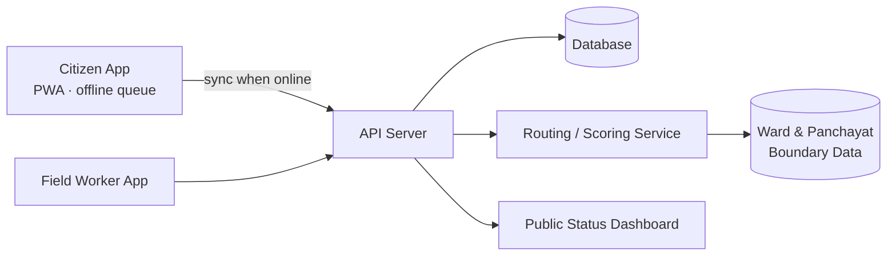
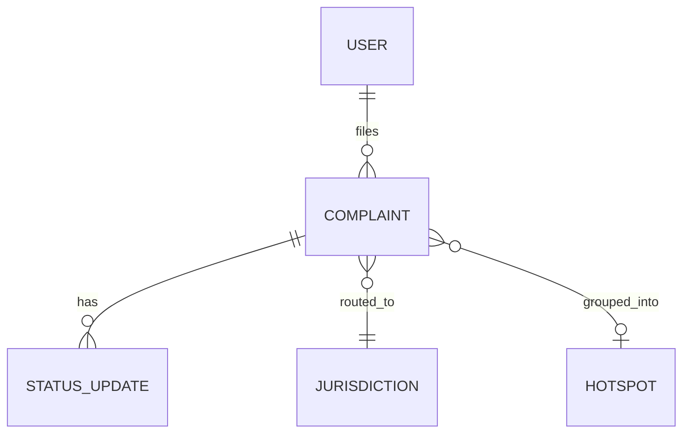

# Architecture

[← Back to README](../README.md)

## System Diagram

<!-- Required: a diagram, not just text. Mermaid renders natively on GitHub.
An exported PNG under docs/images/ is also fine. -->

## Request Walkthrough

<!-- Trace ONE real request end-to-end, e.g. "citizen files a complaint". -->

1. `<Client captures photo + GPS, stores in local queue>`
2. `<On reconnect, POST /api/complaints>`
3. `<Server checks duplicates within 50 m / 7 days>`
4. `<Routing service resolves jurisdiction + confidence>`
5. `<Complaint lands in the right queue; citizen sees status>`

## Components

| Component | Responsibility | Tech | Code location |
|---|---|---|---|
| `<Client>` | `<...>` | `<...>` | `src/<...>` |
| `<API>` | `<...>` | `<...>` | `src/<...>` |
| `<Data store>` | `<...>` | `<...>` | `src/<...>` |
| `<ML / rules engine>` | `<...>` | `<...>` | `src/<...>` |

## Data Model

| Entity | Key fields | Notes |
|---|---|---|
| `<Complaint>` | `<id, type, lat, lng, photo_url, trust_score, status>` | `<...>` |
| `<...>` | `<...>` | `<...>` |

## Key APIs

| Method | Endpoint | Purpose | Auth |
|---|---|---|---|
| `POST` | `/api/complaints` | `<...>` | `<anonymous / token>` |
| `GET` | `/api/wards/:id/status` | `<...>` | `<public>` |

## Tech Stack

| Layer | Choice | Why this over alternatives |
|---|---|---|
| Frontend | `<...>` | `<...>` |
| Backend | `<...>` | `<...>` |
| Database | `<...>` | `<...>` |
| ML / AI | `<...>` (details in [ai.md](../ai.md#3-ai-inside-the-product-runtime)) | `<...>` |
| Hosting | `<...>` | `<...>` |

## Data Sources

| Dataset | Source & licence | Real or synthetic | Used for |
|---|---|---|---|
| `<Ward boundaries>` | `<...>` | `<...>` | `<...>` |
