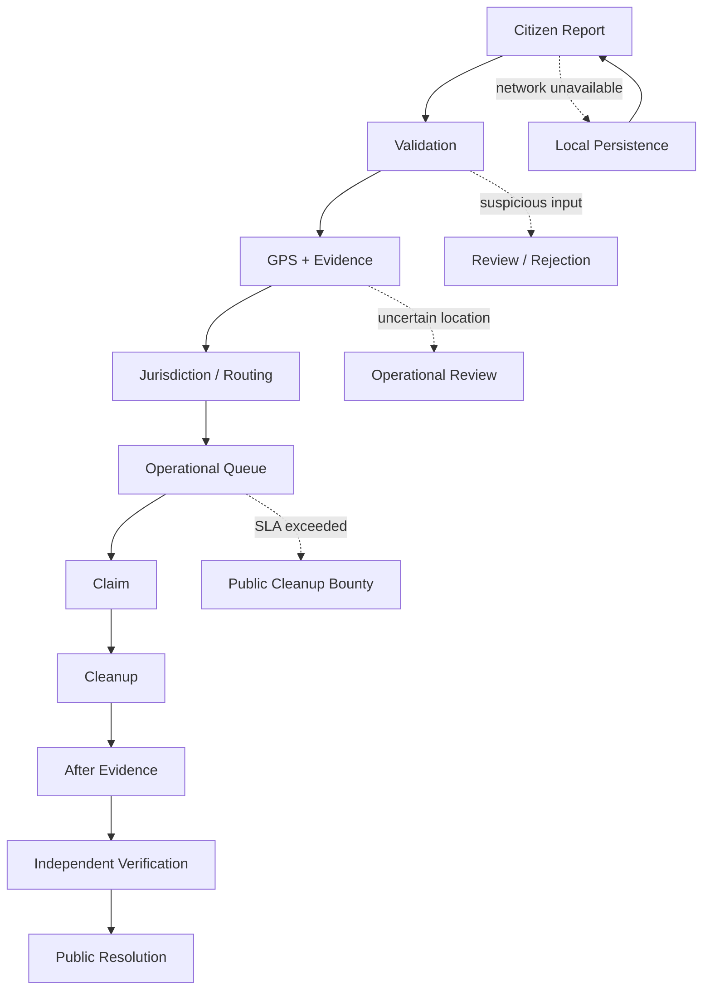

# The Five Hard Constraints

[← Back to README](../README.md)

Mysuru Janseva is designed around the five operational constraints identified in the challenge. The implementation combines structured report creation, location-aware civic workflows, role-based operations, public lifecycle tracking, verification, and resilience to temporary connectivity loss.

The key design principle is:

> **The platform should make a civic issue easy to report, difficult to manipulate, easy to route, visible while it is being handled, and independently verifiable when someone claims it is resolved.**

| # | Constraint | Status |
|---|---|---|
| 1 | Fake, spam and harassment reports | ✅ Handled through validation, structured workflows, permissions and human verification |
| 2 | Unclear jurisdiction | ✅ Handled through location-aware routing and operational review |
| 3 | Prioritisation beyond "most votes" | ✅ Handled through operational signals such as issue type, status, age/SLA and location/context |
| 4 | Bad input: duplicate, fake evidence, wrong location, abuse | ✅ Handled through input validation, evidence review and lifecycle controls |
| 5 | Works without internet | ✅ Supported through local persistence/fallback for supported reporting interactions; server-dependent actions require connectivity |

---

## 1. Fake, spam and harassment reports

### Problem

A civic platform cannot assume that every submitted report is genuine, relevant or appropriate. A public reporting system needs to accept reports without allowing unchecked submissions to become unquestioned operational truth.

### Our approach

Mysuru Janseva treats a citizen report as a **submitted civic claim supported by structured information and evidence**, not as an automatically verified fact.

The reporting flow captures structured information such as:

- Issue category
- Description
- Current reporting location
- GPS accuracy and capture time
- Photo/video evidence
- Report ownership and lifecycle information

Reports then move through a controlled operational lifecycle:

```text
SUBMITTED
   ↓
OPEN
   ↓
CLAIMED
   ↓
CLEANUP IN PROGRESS
   ↓
PENDING VERIFICATION
   ↓
VERIFIED / REJECTED
```

This means a report can become operationally actionable without being treated as permanently trustworthy merely because it was submitted.

### Human verification

Authorized operational users manage the workflow, while verification is separated from the actor who performed the cleanup.

The service/API layer also prevents an assigned actor from independently verifying their own work.

### Abuse handling

Structured input validation, role permissions and operational review prevent inappropriate or suspicious submissions from automatically receiving privileged operational actions.

### Code

```text
app/api/reports/[id]/verify/route.ts
lib/services/reports.ts
lib/role-context.tsx
app/report/page.tsx
```

---

## 2. Unclear jurisdiction

### Problem

A civic complaint is useful only when the responsible operational authority can be identified.

### Our approach

Every report is geographically anchored using the location captured during reporting.

The system stores:

```text
latitude
longitude
GPS accuracy
captured_at
```

This location is used for map display and jurisdiction/routing logic.

The intended flow is:

```text
Citizen captures location
        ↓
Report stores coordinates
        ↓
Routing / jurisdiction logic
        ↓
Correct operational queue
        ↓
Municipal Officer / Eligible NGO
```

### Boundary cases

Location is treated as a point-in-time report location rather than continuous citizen tracking.

When the location does not provide a clear operational answer, the report remains in the workflow for operational review rather than being silently discarded.

This is important for boundary areas and uncertain jurisdiction: **uncertainty becomes an explicit handling condition instead of an invisible failure.**

### Code

```text
components/map/MapComponents.tsx
components/map/MapSection.tsx
lib/services/reports.ts
```

---

## 3. Prioritisation beyond "most votes"

### Problem

The number of people reporting an issue is useful context, but it should not be the only operational signal.

Mysuru Janseva therefore does not model civic importance as a simple vote leaderboard.

### Operational signals

| Signal | Why it matters |
|---|---|
| Issue category/type | Different civic issues may require different operational urgency |
| Current status | An open issue and an already-claimed issue need different handling |
| Age of report | Older unresolved issues should remain visible to operations |
| SLA state | Reports approaching or crossing the resolution threshold need attention |
| Location / ward context | Helps operations understand where the issue is occurring |
| Evidence | Stronger evidence gives staff more context for action and verification |
| Bounty eligibility | Long-unresolved eligible reports can enter the public cleanup workflow |

The operations dashboard exposes the report queue and lifecycle state so that staff can act using more than a simple popularity count.

### Why not "most votes"?

A report affecting a less active area can still require attention. Likewise, a highly reported issue may already be claimed or under cleanup.

The platform therefore focuses on **operational accountability and lifecycle state**, rather than treating popularity as the sole measure of priority.

### Code

```text
lib/services/reports.ts
app/dashboard/page.tsx
lib/mock-data.ts
```

---

## 4. Bad input

Bad input is handled at multiple points instead of relying on one validation check.

| Input | What Mysuru Janseva does |
|---|---|
| Duplicate report | Existing reports remain visible and comparable through the public report/map workflow; operational staff can review repeated reports instead of automatically treating every submission as a new independent civic issue. |
| Fake / unrelated photo | Evidence is supporting information, not automatic proof of resolution. Questionable evidence can be handled through the verification workflow. |
| Wrong location | GPS/location data is captured with accuracy metadata and remains part of the report record so the location can be reviewed before operational handling. |
| Abusive message | Structured report fields and operational review reduce the chance that abusive content can directly trigger privileged civic actions. |
| Missing / invalid information | Client-side report validation prevents incomplete required fields from being submitted as a complete report. |
| Self-verification / collusion | The API/service layer rejects attempts by the cleanup actor to independently verify the same report. |
| Invalid role action | Role-based permissions prevent citizens/public visitors from accessing operational claim, cleanup or verification actions. |

### Verification is part of the design

The system separates:

```text
REPORT OWNER
    = citizen who created the report

ASSIGNED ACTOR
    = municipal officer or NGO/community actor doing the work

VERIFIER
    = independent verification actor
```

This separation is a core integrity control.

### Code

```text
app/report/page.tsx
app/api/reports/[id]/verify/route.ts
lib/services/reports.ts
lib/role-context.tsx
```

---

## 5. Works without internet

### Problem

Civic reporting often happens in the field, where mobile connectivity can be weak or temporarily unavailable.

### Our approach

The application is designed so that temporary backend/network failure does not immediately destroy the user's reporting state.

The current MVP uses local persistence and fallback behavior for supported interactions:

```text
Citizen starts report
        ↓
Capture location / evidence / details
        ↓
Network available?
   ↙             ↘
 YES              NO / FAILED
 ↓                  ↓
POST to API      Preserve locally
 ↓                  ↓
Supabase         Retry / continue
 ↓                  ↓
Public lifecycle updates when backend is available
```

The backend remains the authoritative source once synchronization succeeds.

### What can continue locally

Supported client-side interactions can preserve report state during a temporary connectivity failure, allowing the user to avoid losing work.

### What requires connectivity

Actions that need current server-side state still require a connection, including:

- Reading newly changed backend data
- Claiming a report
- Starting/completing server-side cleanup updates
- Verification
- Realtime updates
- Server-confirmed synchronization

### Important limitation

Offline behavior is intended as a **resilience mechanism**, not as an independent offline copy of the municipal backend.

### Code

```text
lib/services/reports.ts
lib/role-context.tsx
app/report/page.tsx
```

For the offline test procedure, see:

[setup.md](./setup.md#testing-offline-mode)

---

# Cross-Constraint Design

The five constraints are connected rather than implemented as five isolated features.



This gives the system a common accountability chain:

```text
Input
  ↓
Evidence
  ↓
Location
  ↓
Routing
  ↓
Action
  ↓
Proof
  ↓
Verification
  ↓
Public history
```

---

# Why this architecture matters

The platform does not try to solve civic problems with one automated score or one AI model.

Instead, it combines:

**structured input + geographic context + role-based actions + operational lifecycle + independent verification + public transparency + resilience**

That combination is what turns a simple complaint form into a **real-time civic accountability and coordination layer**.

---

# Implementation Summary

| Constraint | Mysuru Janseva approach |
|---|---|
| Fake / spam / harassment | Structured reports, validation, role restrictions and human verification |
| Unclear jurisdiction | GPS coordinates, map context and routing/operational review |
| Prioritisation | Issue type, lifecycle state, report age/SLA, location/context and operational signals |
| Bad input | Form validation, evidence review, lifecycle controls and anti-collusion rules |
| Offline operation | Local persistence/fallback for supported interactions, with server synchronization when connectivity returns |

> **Core principle:** automation helps route and organize civic work, but the authoritative civic lifecycle remains auditable, role-controlled and independently verifiable.
